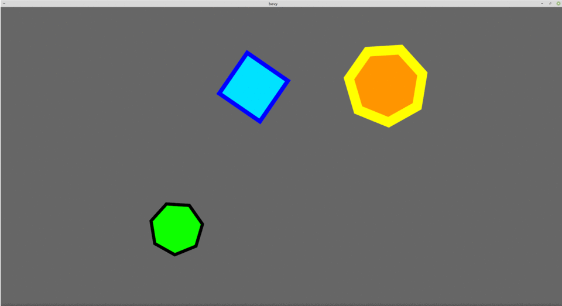

# geometry_collision

download  bevy_prototype_lyon  available here:   https://github.com/Nilirad/bevy_prototype_lyon

place geometry_collision.rs file inside folder bevy_prototype_lyon/examples

cargo run --example geometry_collision

TODO : 

+filter query toavoid code duplication , i was not able to work with an enum , so i worked with With<ExampleShapeA> With<ExampleShapeB> and With<ExampleShapeC>.

+ fix Z-depth ,
  
+add repulsive collision or gravity attraction, dont know how to make working heron or rapier with bevy_prototype_lyon.
  
+i'd like to add fields to give eating shapes and become bigger with increasing sides.
  
+ dark triangle could be venimous and make explode big shapes.

+make bouncing shapes or sticky shapes on walls.
  

